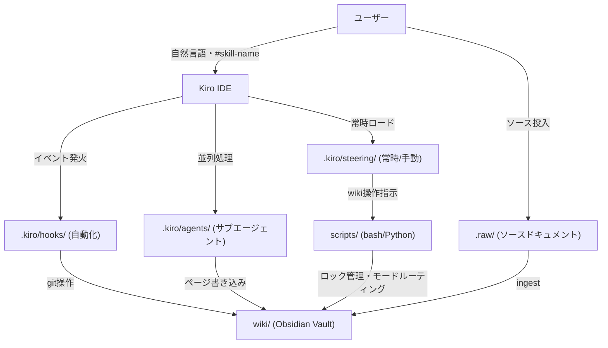
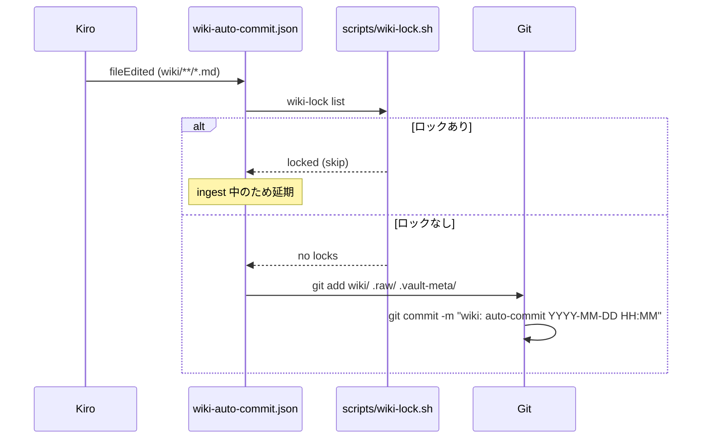
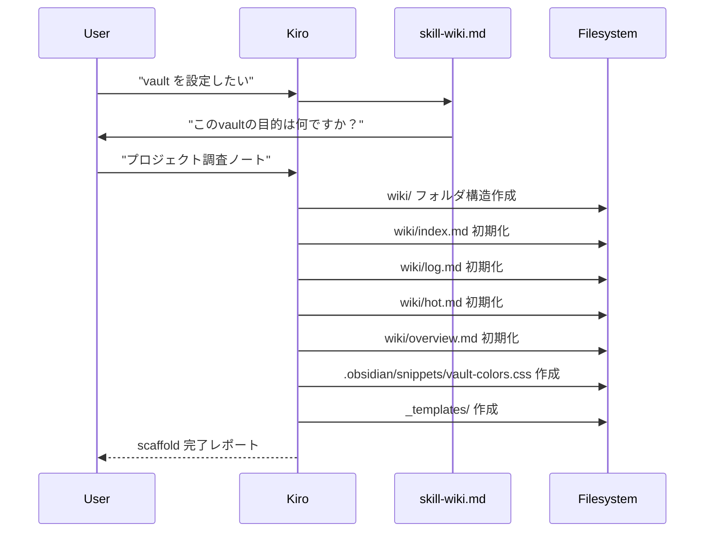
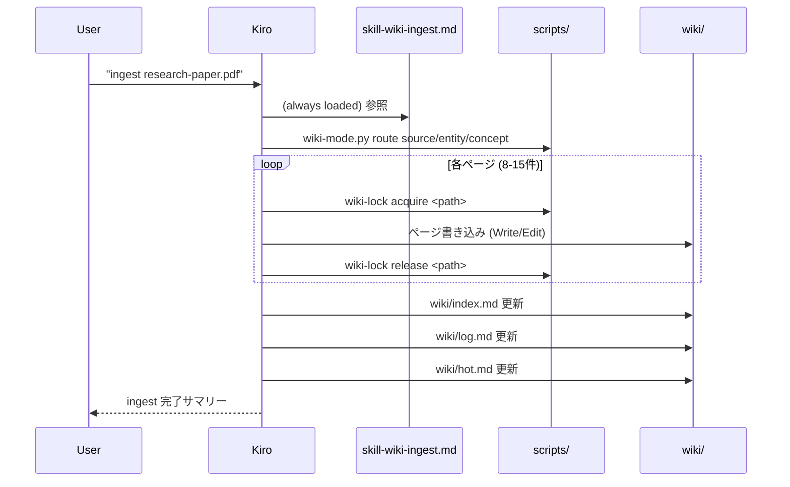
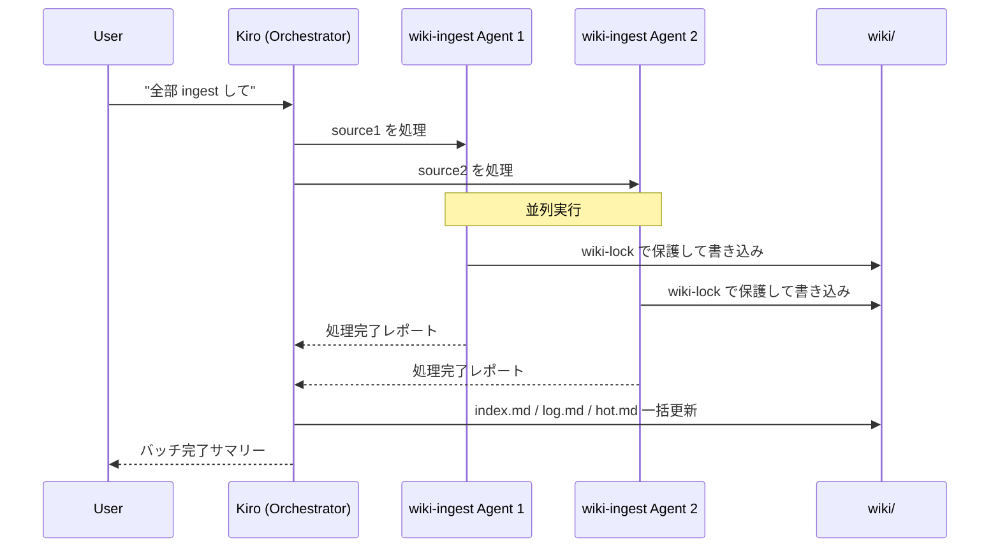
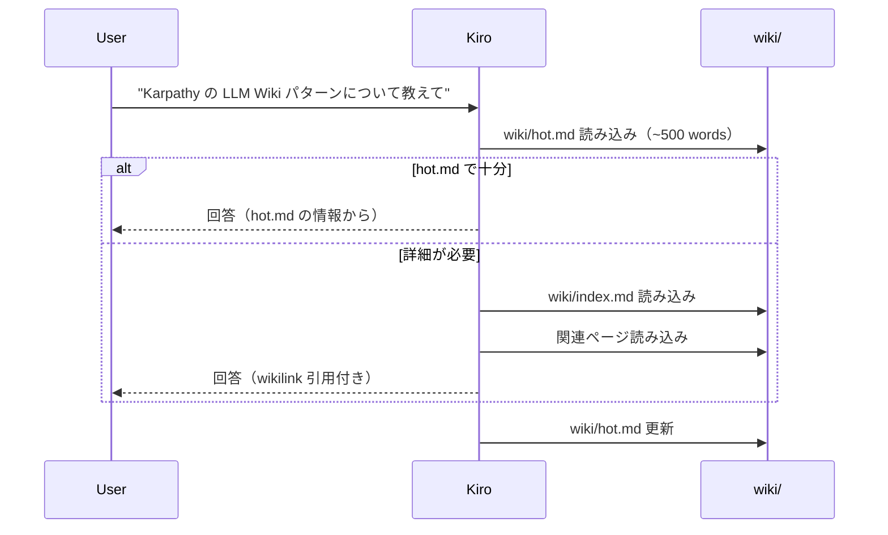
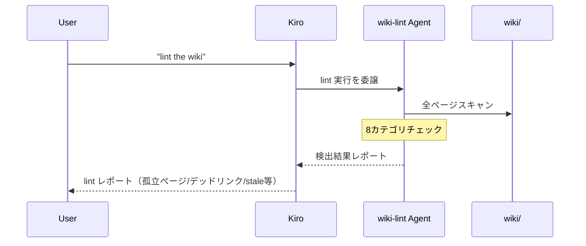

# 機能設計書

## システム構成図



## コンポーネント設計

### 1. Steering ファイル（`.kiro/steering/`）

Kiro の steering は `inclusion` frontmatter で2種類に分かれる。

| ファイル | inclusion | 役割 |
|---------|-----------|------|
| `wiki-core.md` | always | Vault 構造・規約・hot cache 指示。常時コンテキストに注入 |
| `skill-wiki.md` | manual | Vault scaffold 手順。`#skill-wiki` で呼び出し |
| `skill-wiki-ingest.md` | always | ingest は頻繁に呼ばれるため常時ロード |
| `skill-wiki-query.md` | manual | クエリ手順。`#skill-wiki-query` で呼び出し |
| `skill-wiki-lint.md` | manual | lint 手順。`#skill-wiki-lint` で呼び出し |
| `skill-wiki-mode.md` | manual | Methodology mode。`#skill-wiki-mode` で呼び出し |
| `skill-autoresearch.md` | manual | 自律リサーチ。`#skill-autoresearch` で呼び出し |
| `skill-save.md` | manual | 会話保存。`#skill-save` で呼び出し |
| `skill-think.md` | manual | 10原則思考ループ。`#skill-think` で呼び出し |

**スキル起動パターン（Kiro 固有）**:

Claude Code では `/wiki` でスキルをロードするが、Kiro では以下の2経路がある:
1. **`#skill-name` 明示参照**: ユーザーまたは hook の prompt 内で `#skill-wiki-ingest` のように記述
2. **自然言語トリガー**: `wiki-core.md` に「"ingest" と言われたら `#skill-wiki-ingest` を参照せよ」と定義

### 2. Hooks（`.kiro/hooks/`）

| ファイル | イベント種別 | トリガー条件 | アクション |
|---------|------------|------------|----------|
| `wiki-ingest.json` | userTriggered | ユーザー起動 | ingest フロー開始 |
| `wiki-auto-commit.json` | fileEdited | `wiki/**`, `.raw/**`, `.vault-meta/**` | git auto-commit |
| `wiki-session-start.json` | userTriggered | セッション開始時に手動起動 | hot.md 読み込み |

**auto-commit hook の動作フロー**:



### 3. Agents（`.kiro/agents/`）

| ファイル | 用途 | 呼び出し元 |
|---------|------|----------|
| `wiki-ingest.md` | 並列バッチ ingest。1ソース=1エージェント | skill-wiki-ingest |
| `wiki-lint.md` | lint チェック実行 | skill-wiki-lint |

### 4. Scripts（`scripts/`）

**原則変更なし**: claude-obsidian 原本をそのまま使用する。Kiro 固有の変更は不要。詳細は `docs/development-guidelines.md`「スクリプトファイル」セクション参照。

claude-obsidian から変更なしで移植するスクリプト群。

| スクリプト | 言語 | 用途 |
|----------|------|------|
| `wiki-lock.sh` | bash | per-file advisory ロック（並列 ingest の競合防止） |
| `wiki-mode.py` | Python | Methodology mode ルーター（page path 解決） |
| `bm25-index.py` | Python | BM25 インデックス構築（P2: wiki-retrieve） |
| `retrieve.py` | Python | ハイブリッド検索（P2） |
| `rerank.py` | Python | コサイン再ランク（P2） |
| `contextual-prefix.py` | Python | Anthropic API 文脈付与（P2） |
| `detect-transport.sh` | bash | Vault transport 自動検出 |
| `allocate-address.sh` | bash | DragonScale アドレス割り当て（P2） |
| `boundary-score.py` | Python | タイリング境界スコア（P2） |
| `tiling-check.py` | Python | セマンティックタイリング検証（P2） |

---

## ユースケース設計

### UC-1: Vault Scaffold

**トリガー**: ユーザーが "vault を設定したい" / "wiki を作って" と発言



### UC-2: Source Ingest（シングル）

**トリガー**: ユーザーが "ingest [filename]" と発言



### UC-3: Source Ingest（バッチ・並列）

**トリガー**: ユーザーが "これら全部 ingest して" と発言（複数ファイル）



### UC-4: Wiki Query

**トリガー**: ユーザーが "X について何を知ってる？" と発言



### UC-5: Wiki Lint

**トリガー**: ユーザーが "lint the wiki" と発言



---

## Vault ファイル構造

```
<vault-root>/
├── .raw/                        # ソースドキュメント（変更禁止）
├── .vault-meta/
│   ├── transport.json           # transport 自動検出結果
│   ├── mode.json                # methodology mode 設定
│   ├── auto-commit.disabled     # 存在する場合 auto-commit 無効
│   └── hook.log                 # hook 実行ログ
├── wiki/
│   ├── index.md                 # 全ページのマスターカタログ
│   ├── log.md                   # 追記専用オペレーションログ
│   ├── hot.md                   # Hot Cache（~500 words）
│   ├── overview.md              # エグゼクティブサマリー
│   ├── sources/                 # ソースサマリーページ
│   ├── entities/                # 人物・組織・製品ページ
│   │   └── _index.md
│   ├── concepts/                # 概念・パターン・フレームワーク
│   │   └── _index.md
│   ├── domains/                 # トップレベルトピック
│   │   └── _index.md
│   ├── comparisons/             # 比較分析ページ
│   ├── questions/               # クエリへの回答ページ
│   └── meta/                    # ダッシュボード・lint レポート
├── _templates/                  # Obsidian Templater テンプレート
├── .obsidian/
│   └── snippets/
│       └── vault-colors.css     # ファイルエクスプローラー配色
├── .kiro/
│   ├── steering/
│   │   ├── wiki-core.md         # inclusion: always
│   │   ├── skill-wiki.md        # inclusion: manual
│   │   ├── skill-wiki-ingest.md # inclusion: always
│   │   ├── skill-wiki-query.md  # inclusion: manual
│   │   ├── skill-wiki-lint.md   # inclusion: manual
│   │   ├── skill-wiki-mode.md   # inclusion: manual
│   │   ├── skill-autoresearch.md# inclusion: manual
│   │   ├── skill-save.md        # inclusion: manual
│   │   └── skill-think.md       # inclusion: manual
│   ├── hooks/
│   │   ├── wiki-ingest.json     # userTriggered
│   │   ├── wiki-auto-commit.json# fileEdited
│   │   └── wiki-session-start.json # userTriggered
│   └── agents/
│       ├── wiki-ingest.md       # 並列バッチ ingest
│       └── wiki-lint.md         # lint チェック
└── scripts/                     # bash/Python ヘルパースクリプト（claude-obsidian から移植）
```

---

## Hot Cache 仕様

wiki/hot.md は ~500 words のセッション間コンテキストキャッシュ。

**フォーマット**:
```markdown
---
type: meta
title: "Hot Cache"
updated: YYYY-MM-DDTHH:MM:SS
---

# Recent Context

## Last Updated
YYYY-MM-DD. [何が起きたか]

## Key Recent Facts
- [最重要の最近の知見]
- [2番目に重要な知見]

## Recent Changes
- Created: [[New Page 1]], [[New Page 2]]
- Updated: [[Existing Page]] (Xに関するセクションを追加)
- Flagged: [[Page A]] と [[Page B]] の間で Y に関する矛盾

## Active Threads
- ユーザーが現在 [トピック] を調査中
- 未解決の疑問: [調査中の事項]
```

**更新タイミング**:
- ingest 完了後
- 重要なクエリ交換後
- セッション終了時（Kiro では手動またはユーザー指示で）

---

## Methodology Mode ルーティング

`scripts/wiki-mode.py` が `.vault-meta/mode.json` を参照して page path を解決する。

| mode | source path | entity path | concept path |
|------|------------|------------|-------------|
| generic（デフォルト） | wiki/sources/\<slug>.md | wiki/entities/\<Name>.md | wiki/concepts/\<Name>.md |
| lyt | wiki/notes/\<slug>.md | wiki/notes/\<Name>.md | wiki/notes/\<Name>.md |
| para | wiki/resources/incoming/\<slug>.md | wiki/resources/\<Name>.md | wiki/resources/\<Name>.md |
| zettelkasten | wiki/\<timestamp>-\<slug>.md | wiki/\<timestamp>-\<Name>.md | wiki/\<timestamp>-\<Name>.md |

---

## wiki-lock 並列安全性

parallel ingest 時に複数エージェントが同一ページへ書き込む競合を防ぐ。

- **獲得**: `bash scripts/wiki-lock.sh acquire <vault-relative-path>`
- **解放**: `bash scripts/wiki-lock.sh release <vault-relative-path>`
- **タイムアウト**: デフォルト 60 秒で自動解放（stale lock 回避）
- **失敗時**: rc=75 が返る → 2秒待ちリトライ → それでも失敗なら wiki/log.md にスキップ記録

---

## Claude Code との機能差分（Kiro 制約）

| 機能 | Claude Code | Kiro | 対応方針 |
|-----|------------|------|---------|
| スキル起動 | `/wiki` コマンド | `#skill-wiki` + 自然言語 | steering manual inclusion |
| PostCompact hook | コンテキスト圧縮後 hot.md 再読 | 相当なし | ユーザー手動または wiki-core.md に常時指示 |
| SessionStop hook | セッション終了時 hot.md 更新指示 | 相当なし | ユーザー指示 or wiki-core.md の指示 |
| SessionStart hook | 起動時 hot.md サイレント読み込み | userTriggered hook で代替 | `wiki-session-start.json` |
| PostToolUse hook | Write/Edit 後 auto-commit | fileEdited hook で代替 | `wiki-auto-commit.json` |

---

## エラーハンドリング

| エラー種別 | 処理 | ユーザーへの表示 |
|----------|------|----------------|
| wiki-lock タイムアウト | 2 秒待ちリトライ → スキップ | wiki/log.md にスキップ記録 |
| .raw/ ファイルが見つからない | ingest 中断 | "ファイル X が .raw/ に見つかりません" |
| git commit 失敗（dirty tree 等） | hook が exit 0 で続行 | .vault-meta/hook.log にエラー記録 |
| wiki-mode.py 実行失敗 | generic モードにフォールバック | サイレント（ログのみ） |
| scripts/ が存在しない | 機能縮退（lock なし ingest） | "scripts/wiki-lock.sh が見つかりません。並列安全性が無効です" |

---

## テスト戦略

### 動作確認（機能テスト）

各機能は Kiro 上での実際の動作確認を主テストとする:

1. **Vault scaffold**: `#skill-wiki` → フォルダ構造が作成されること
2. **Single ingest**: `.raw/` にサンプルファイル投入 → wiki ページが 8-15 件生成されること
3. **Batch ingest**: 3 ファイル同時 → 並列エージェントが起動し競合なく完了すること
4. **Query**: wiki 構築後に質問 → wikilink 引用付き回答が返ること
5. **Lint**: "lint the wiki" → 8 カテゴリのチェックレポートが出ること
6. **Auto-commit**: wiki ページ編集後 → git log に auto-commit が記録されること

### スクリプト単体テスト

claude-obsidian の既存テストスイートを参照・流用:
- `tests/test_wiki_lock.sh` — wiki-lock の並列安全性
- `tests/test_wiki_mode.py` — mode ルーティング
- `tests/test_bm25_index.py` — BM25 インデックス（P2）
